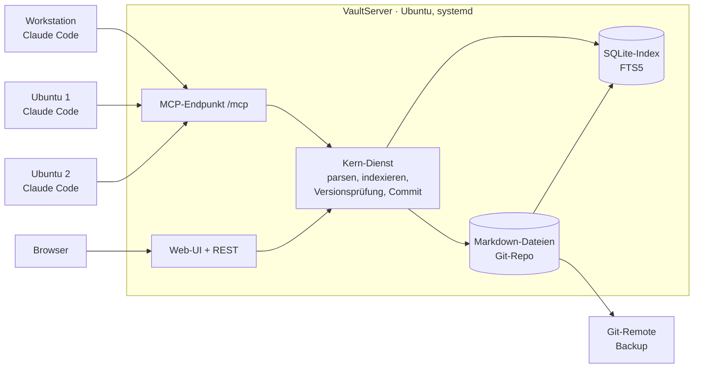

# VaultServer – Konzept (Obsidian-Ersatz)

Stand: 2026-10-05 · Live-Version: [Claude Doc](https://claude.ai/code/artifact/c6090794-dc51-42e7-9285-c325fdac0748)

## Ziel und Problem

VaultServer ersetzt den Obsidian-MCP-Zugriff durch einen eigenen Dienst auf einem Ubuntu-Rechner, der rund um die Uhr läuft. Er findet Inhalte in Millisekunden und liefert nur die Abschnitte, die ein Agent wirklich braucht.

Heute greifen die Claude-Code-Instanzen auf den Ubuntu-Rechnern über das Obsidian-Plugin „Local REST API“ auf den Vault zu. Dieses Plugin läuft nur, solange Obsidian auf der Workstation offen ist. Geht die Workstation nachts in den Standby, sind Nachtläufe blind. Zusätzlich lesen Agenten oft ganze, sehr große Dateien, um eine einzige Angabe zu finden.

Anforderungen:

- Immer erreichbar, unabhängig von der Workstation.
- So flexibel wie Obsidian: Ordner, Unterordner, freie Notizen, Wikilinks, Bilder.
- Deutlich schneller durchsuchbar als der Markdown-Bestand.
- Zugriff für alle Claude-Code-Instanzen über einen MCP-Server.
- Ein Browser-Viewer mit Ordnerbaum; Bearbeiten im Browser ist erwünscht.

## Ist-Analyse des Vaults

Der Vault ist klein genug für einen einzigen SQLite-Index. Das eigentliche Problem sind einzelne sehr große Dateien, die Agenten komplett lesen.

| Merkmal | Befund |
| --- | --- |
| Umfang | ca. 250 Markdown-Notizen, ca. 3,5 MB Text, 36 Bilder, 6 HTML-Mockups, 1 PDF |
| Synchronisation | Git-Repo mit Remote, Obsidian-Git zieht alle 10 Minuten |
| Agentenzugriff | Plugin „Local REST API“, nur bei laufendem Obsidian |
| Muster | Übersichtsdatei plus eine Datei je Eintrag (`Features.md` → `Features/34-…md`, `Fixliste.md` → `Fixliste/FIX-054.md`) |
| Links | Wikilinks mit Alias (`[[Datei\|Text]]`) und mit Pfad (`[[Ordner/Datei\|…]]`) |
| Eigenschaften | Teils als Aufzählung im Text (`- Priorität: hoch`, `- Status: erledigt`), teils als YAML-Frontmatter (`aliases`, `status`) |
| Aufgaben | Checkboxen `- [ ]` / `- [x]` in Akzeptanzkriterien und offenen Fragen |
| Größte Dateien | Archivdateien ~200 KB, Phasenplan 140 KB, einzelne Feature-Dateien 50–60 KB |

Folgerung: Der Index muss Notizen an Überschriften in Abschnitte zerlegen und Eigenschaften aus Frontmatter und aus Zeilen wie `- Status: …` gleich behandeln. Nur dann lassen sich Fragen wie „alle offenen Fixes mit Priorität hoch“ ohne Lesen ganzer Dateien beantworten.

## Architektur

Ein einzelner Python-Dienst (FastAPI) auf einem Ubuntu-Rechner liefert MCP-Endpunkt und Web-Oberfläche. Die Markdown-Dateien im Git-Repo bleiben die Quelle der Wahrheit; SQLite ist nur ein schneller, jederzeit neu aufbaubarer Index.



Alle Schreibzugriffe laufen durch den Kern-Dienst. Er schreibt die Datei, aktualisiert den Index und committet in einem Schritt.

- **Warum Markdown + Git:** keine Abhängigkeit von einem Datenbankformat, Historie und Diffs gratis, Obsidian bleibt in der Übergangszeit als Editor nutzbar.
- **Warum SQLite mit FTS5:** eine Datei, kein eigener Datenbankserver, Volltextsuche mit Ranking (BM25) in Millisekunden bei diesem Umfang.
- **Änderungen von außen:** Ein Datei-Wächter erkennt Dateien, die per `git pull` oder direkt geändert wurden, und indexiert sie nach. Beim Start gleicht der Dienst Index und Dateien über Prüfsummen ab.
- **Transport:** MCP über Streamable HTTP, damit alle Rechner denselben Server nutzen; kein lokaler Prozess je Rechner.

## Datenmodell des Index

| Tabelle | Inhalt | Wofür |
| --- | --- | --- |
| `notes` | Pfad, Titel, Ordner, Größe, Prüfsumme, geändert am, Version | Baum, Änderungsliste, Versionsprüfung |
| `sections` | Notiz, Überschrift, Ebene, Überschriftenpfad (`Feature 34 > Stufe 2 > Tests`), Zeilenbereich, Text | gezieltes Lesen, Suchtreffer mit Fundstelle |
| `sections_fts` | FTS5 über Titel, Überschriftenpfad und Text; Tokenizer `unicode61` mit Umlaut-Normalisierung | Volltextsuche mit Ranking und Ausschnitt |
| `links` | Quelle, Ziel, Alias, Abschnitt, aufgelöst ja/nein | Backlinks, kaputte Links, Umbenennen mit Nachziehen |
| `properties` | Notiz, Schlüssel, Wert (normalisiert) aus Frontmatter und `- Schlüssel: Wert`-Zeilen | Abfragen wie Status = offen, Priorität = hoch |
| `tags` | Notiz, Tag (`#tag` und Frontmatter) | Filter, Tag-Liste |
| `tasks` | Notiz, Abschnitt, Zeile, Text, erledigt ja/nein | offene Akzeptanzkriterien und Fragen auflisten |
| `aliases` | Notiz, Alias | Wikilinks wie in Obsidian auflösen |
| `attachments` | Pfad, Typ, Größe | Bilder, PDFs und HTML-Mockups im Viewer zeigen |

Jede Zeile der Form `- Schlüssel: Wert` und jeder Frontmatter-Eintrag wird als Eigenschaft indexiert, ohne feste Liste. Eine kleine Konfiguration legt nur fest, welche Werte gleichbedeutend sind (z. B. „erledigt (Test)“ → erledigt). Der Index ist vollständig aus den Dateien ableitbar und per Befehl in Sekunden neu aufbaubar.

## MCP-Werkzeuge

Ein Agent sucht erst oder holt die Gliederung und liest dann nur den passenden Abschnitt.

| Werkzeug | Zweck | Rückgabe |
| --- | --- | --- |
| `search` | Volltextsuche, optional nach Ordner, Tag oder Eigenschaft gefiltert | Treffer mit Pfad, Überschriftenpfad, Ausschnitt, Rang |
| `query` | Abfrage über Eigenschaften, z. B. Ordner `Fixliste`, Status ≠ erledigt, Priorität = hoch | Notizen mit den abgefragten Werten |
| `outline` | Gliederung einer Notiz | Überschriften mit Größe je Abschnitt |
| `read` | Notiz lesen, ganz, nur ein Abschnitt oder Zeilenbereich | Text plus Version |
| `list` | Ordnerinhalt oder Baum bis Tiefe n | Ordner und Notizen mit Titel, Größe, Datum |
| `backlinks` | Wer verweist auf diese Notiz | Quellen mit Abschnitt |
| `tasks` | Offene oder erledigte Checkboxen, nach Ordner gefiltert | Aufgaben mit Fundstelle |
| `recent` | Zuletzt geänderte Notizen | Pfad, Zeit, Commit-Nachricht |
| `write` | Notiz anlegen oder ersetzen | neue Version |
| `patch_section` | Abschnitt ersetzen, anhängen oder neu einfügen | neue Version |
| `set_property` | Eigenschaft setzen, z. B. Status = erledigt | neue Version |
| `move` | Verschieben/Umbenennen, Links werden nachgezogen | angepasste Notizen |
| `delete` | Notiz löschen (bleibt in der Git-Historie) | Bestätigung |

**Parallele Agenten:** Jeder schreibende Aufruf nimmt die zuletzt gelesene Version mit. Hat sich die Notiz inzwischen geändert, wird der Aufruf abgelehnt und liefert den aktuellen Stand zurück. Abschnitts-Patches kollidieren nur bei demselben Abschnitt.

**Nachvollziehbarkeit:** Jede Änderung wird ein Git-Commit mit dem Namen des aufrufenden Agenten, z. B. `ubuntu1/claude-code: FIX-054 Status erledigt`.

## Web-Oberfläche

- **Links, Ordnerbaum:** auf-/zuklappen, anlegen, umbenennen, verschieben per Rechtsklick oder Ziehen.
- **Mitte, Notiz:** Markdown gerendert, Wikilinks klickbar, Bilder und HTML-Mockups eingebettet, Checkboxen anklickbar; Bearbeiten mit CodeMirror und Wikilink-Vervollständigung.
- **Rechts, Kontext:** Gliederung, Backlinks, Eigenschaften, letzte Änderungen aus Git.
- **Oben, Suche:** Schnellsuche mit Ausschnitt, Sprung zum Abschnitt.
- **Konflikte:** Bei gleichzeitiger Änderung durch einen Agenten zeigt der Editor beide Stände nebeneinander.

Eine kleine Single-Page-App, ausgeliefert vom selben FastAPI-Dienst, mit derselben Kernlogik wie der MCP-Server.

### Ein Port für alles (8100)

| Pfad | Wofür |
| --- | --- |
| `http://<ubuntu-rechner>:8100/` | Web-Viewer und Editor (Anmeldung mit Benutzer/Passwort) |
| `http://<ubuntu-rechner>:8100/mcp` | MCP-Server für Claude Code (Bearer-Token je Rechner) |
| `http://<ubuntu-rechner>:8100/api/…` | REST-API für den Browser |

Einbindung in Claude Code je Rechner:

```
claude mcp add --transport http vaultserver http://<ubuntu-rechner>:8100/mcp --header "Authorization: Bearer <token>"
```

## Betrieb, Sicherheit und Migration

- **Migration:** `git clone` des bestehenden Vault-Repos auf den Ubuntu-Rechner.
- **Betrieb:** systemd-Dienst mit Neustart bei Fehler; optional Docker. Port 8100. Konfiguration in einer Datei (Vault-Pfad, Port, Tokens, Werte-Normalisierung).
- **Sicherheit:** nur im LAN; Bearer-Token je Rechner; Web-Oberfläche mit Anmeldung; von außen nur über VPN.
- **Datensicherung:** regelmäßiger Push zum Git-Remote; der Index braucht keine Sicherung.
- **Übergang:** Obsidian kann mit Obsidian-Git parallel weiterlaufen; der Datei-Wächter nimmt eingehende Änderungen auf.

### Phasen

1. **Kern und Index:** Dateien einlesen, Abschnitte, Links, Eigenschaften, FTS5; Neuaufbau-Befehl; Messung der Suchzeiten.
2. **MCP-Server:** Lesewerkzeuge, dann Schreibwerkzeuge mit Versionsprüfung und Git-Commit.
3. **Web-Viewer:** Ordnerbaum, gerenderte Notiz, Suche, Backlinks, nur lesend.
4. **Web-Editor:** Bearbeiten, Anlegen, Verschieben mit Link-Nachzug, Konfliktanzeige.
5. **Umstellung:** Betrieb auf dem Ubuntu-Rechner, alle Rechner umstellen, Obsidian-Plugin abschalten.
6. **Optional:** semantische Suche über lokales Ollama (Embeddings in `sqlite-vec`).

## Entscheidungen (2026-10-05)

- Host: Ubuntu-Rechner, Port 8100 für Web, REST und MCP.
- Name: VaultServer, Repo `oweindl/vaultserver`, MIT-Lizenz.
- Alle `- Schlüssel: Wert`-Zeilen und Frontmatter-Felder sind Eigenschaften.
- Die ausführenden Claude-Code-Instanzen setzen und nutzen diese Eigenschaften konsequent; der Server setzt das durch (Ideen 1 und 2).

## Zusatzfunktionen (Ideen)

1. **`guide`:** liefert Arbeitsregeln je Bereich und erlaubte Eigenschaften/Werte; jeder Agent ruft es zu Beginn auf, ein `CLAUDE.md`-Block auf allen Rechnern verweist darauf.
2. **`create_from_template`:** legt `FIX-0nn` / `Feature nn` mit Pflichtfeldern und automatischer Nummer an und trägt sie in die Übersicht ein; fehlende Pflichtfelder werden abgelehnt.
3. **`claim`:** reserviert einen Eintrag (Status „in Arbeit“, Rechner, Zeit); verfällt nach einer Frist ohne Änderung.
4. **`changes_since`:** geänderte Notizen und Abschnitte seit Commit/Zeitpunkt, für Nachtläufe.
5. **Automatische Übersichten:** `Features.md`, `Fixliste.md`, `Status.md` aus Eigenschaften erzeugt.
6. **`lint`:** kaputte Wikilinks, fehlende Pflichtfelder, doppelte Nummern, unbekannte Statuswerte.
7. **Archiv ausblenden:** Ordner wie `Archiv/` nur auf Wunsch in der Suche.
8. **Commit-Verknüpfung:** Commits `FIX-054: …` im Code-Repo erscheinen im Abschnitt „Umsetzung“.

## Offene Punkte

- [ ] GitHub-Issues für Phasen und Funktionen anlegen
- [ ] Obsidian parallel als Editor weiterverwenden oder nicht
- [ ] Git-Remote des Vaults und Push-Berechtigung des Servers
- [ ] Umfang der Zusatzfunktionen 1–8 final bestätigen
